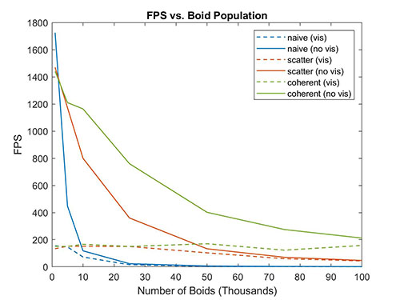

# Project 1 - Flocking
**University of Pennsylvania, CIS 565: GPU Programming and Architecture, Project 1 - Flocking**

* Zheyuan Xie
  * [LinkedIn](https://www.linkedin.com/in/zheyuan-xie)
  * [Github](https://github.com/ZheyuanXie)
  * [Personal Website](http://errorspace.cn)
* Tested on: Windows 10 Pro, i7-7700HQ @ 2.80GHz 2.80GHz, 16GB, GTX 1050 2GB (Dell XPS 15 9560)

## Screenshots
| 5,000 Boids | 100,000 Boids |
|--|--|
| |  |

## Performance Analysis
### 1. Number of Boids
The figure below shows the relationship between performance and boid population. We can observe:
 - For all three methods, performance decrease as the number of boids increase. 
 - The naive method has the best performance when the number of boids are small (below 1.5k), but it decays rapidly as the number of boids increase. 
 - The coherent uniform grid has the best performance when the number of boids are large.
  - Visualization generally decrease the framerate.
  - When the number of boids is small, visualization is the performance bottleneck; When the number of boids is large, computation takes over.

 

 In the naive method, for each boid we check all other N-1 boids. The time complexity is directly `O(N^2)`. The uniform grid methods is less sensitive to the increase in boids since for each boid we only check its neighboring boids within some distance.

### 2. Block Size
The figure below shows the performance vs block size curve with visualization turned off. We can observe:

 - For all three methods, a jump in performance is observed when blocksize is increased from 16 to 32. 
 - Further increasing the blocksize from 32 to 512 has no significant impact in performance.

 
 
 This is because the warp size is always 32. Having less then 32 threads per block will result in inactive threads in a warp. But further increase the block size beyond 16 will no longer increase the degree of parallelism. 

### 3. Coherent Uniform Grid
Compared with scattered uniform grid, coherent uniform grid has better performance. The performance gap becomes wider as the number of boids increase. This outcome is expected since:
 - We have one less level of indrection, and therefore one less access (`dev_particleArrayIndices`) to the device's global memory.
 - Reshuffling the `dev_pos` and `dev_vel1` allows boids in the same cell occupy contigous memory, increase the chance of cache hit.

### 4. Cell Width & Number of Neighboring Cells
Using half the cell width slightly increase the performance.

||8 Cells, Full Width| 27 Cells, Half Width
|--|--|--|
|5k Boids|1256 FPS|1366 FPS|
|10k Boids|798 FPS |1001 FPS|
|50k Boids|139 FPS |151 FPS|

Though the number of cells needs to be check is larger, the actual volume that is checked is smaller, and therefore the number of boids checked is smaller. Let's say the neighborhood distance is 1 unit:
 - Checking 8 Cells with 2-unit width is equivalent to checking a volume of 4\*4\*4=64 units.
 - Checking 27 Cells with 1-unit width is equivalent to checking a volume of 3\*3\*3=27 units.

 Therefore checking 27 cells with half the cell width means checking less boids and faster computation.
